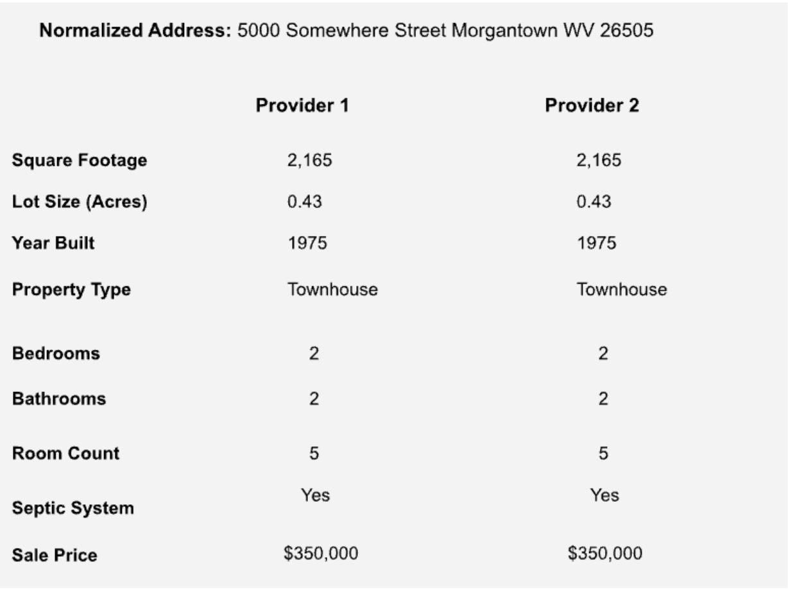

Thanks for your continued interest in Hometap. We’re enthusiastic about what we’re doing and hope to share some of that excitement with you. To help us evaluate how you approach problems and collaborate, we've designed a small exercise that allows you to showcase your skills without requiring an extensive time commitment.

This exercise should take 2-4 hours to complete. Please reach out if you have questions, and submit your work through GitHub or bundled source code with instructions for running the application.


## Project Overview

At Hometap, we help homeowners access their homes' equity without increasing their debt burden. To effectively serve our customers, we integrate with several third-party data providers to retrieve data required for decision-making. For this exercise, imagine you’re creating a small application that enables us to present a subset of property data pulled from two of our automated valuation model (AVM) providers. This data helps us determine a given property's value without conducting time-consuming and expensive traditional appraisals.

## Your Task

Build a simple application with the following components:

1. Backend Service
    - Create a Python-based web service (using libraries like Flask, FastAPI, or Django) that integrates with the provided third-party APIs to retrieve property details from two of our AVM providers.
    - Expose a single endpoint that standardizes the responses received from both providers into a single, consistent response.
    - Consider maintainability by designing the service to make it easy to swap out the third-party APIs in the future.

2. Frontend Interface
    - Create a minimal web page using a framework of your choice (React, Vue.js, or plain HTML/JavaScript).
    - The page should:
        - Allow the user to input an address.
        - Display a subset of the property details for both providers for easy review (see mock below).
        - Retrieve all relevant data from the API constructed in Part 1.
    - Typically, our design team provides clear guidance on how user interfaces should look and operate; however, given that this is a proof-of-concept, we only have a simple mockup to work with.



3. Bonus (OPTIONAL)
    - Add simple error handling (e.g., display an error message if the API call fails).
    - Style the page with essential CSS for a more polished appearance.

## Deliverables

1. A Github repository with:
    - The code for both the backend and frontend.
    - A README with clear setup instructions and explanations of your design choices.

## Notes

- Focus on building something functional and straightforward within 2-4 hours.
- Please include your ideas for extending this solution (e.g., improving scalability or adding features) in the README.
- You do not need to implement complex deployment processes or advanced UI features.
- Property details are subject to change as new information is provided, so the providers cache the property details for up to 24 hours.

## AI Tools

You may use AI-assisted coding tools during this assessment. However, please clearly identify any code or solutions generated with AI assistance in your comments or documentation.

## Ownership

Your submission must represent work you fully understand and can explain in detail. You should be comfortable discussing every aspect of your solution during follow-up interviews.

## Starter Template

As part of this coding exercise, we’ve provided a **starter template** to help streamline your workflow and minimize time spent on boilerplate setup. The template includes:

- **backend:** A Django project preconfigured with environment variable support, an example endpoint for handling query parameters, and helpful utilities for API responses.
- **frontend:** A Vite with TypeScript project, preconfigured to work with Tailwind CSS for a responsive and modern UI. It includes a basic setup for making API calls and rendering data dynamically.

While we **highly recommend** using this template as a base to avoid unnecessary setup time, you are welcome to create your own project from scratch if you prefer. However, using the template will allow you to focus more on the core functionality of the exercise rather than configuration details.

If you choose to use the template, instructions for setup are included in the [STARTER_TEMPLATE.md](STARTER_TEMPLATE.md) file. If you encounter any issues, feel free to troubleshoot as part of the exercise or adapt the setup to your needs.

Happy coding!

## Third-Party APIs Overview

For this exercise, you will integrate with two property details providers, Provider 1 and Provider 2. Please note that these APIs simulate what you may work with within a real scenario, and no actual personal data is stored or retrieved.

### Provider 1

**API Endpoint:** https://property-detail-api.fly.dev/provider-1/property

**API Key:**  3e1a9f18-86c7-4e11-babe-4fd2c7e5e12d

#### Example Usage (cURL)

```bash
$ curl -X GET "https://property-detail-api.fly.dev/provider-1/property?address=123%20Main%20St,%20Anytown,%20USA" \ -H "X-API-KEY: your-api-key" \ -H "Accept: application/json"
```

#### Example Response Payload

```json
{
   "data": {
       "id": "5000-Main-Street-Boston-MA-144124",
       "formattedAddress": "5000 Main Street Boston MA 144124",
       "addressLine1": "5000 Main Street",
       "addressLine2": "Suite 10",
       "city": "Boston",
       "state": "MA",
       "zipCode": "144124",
       "county": "Unknown",
       "latitude": 35.181241,
       "longitude": -84.753462,
       "propertyType": "Townhouse",
       "bedrooms": 2,
       "bathrooms": 4,
       "squareFootage": 1911,
       "lotSizeSqFt": 7778,
       "yearBuilt": 1924,
       "assessorID": "94863-882-8791",
       "legalDescription": "CB 6641 BLK 10 LOT 18",
       "subdivision": "None",
       "zoning": "RM",
       "lastSaleDate": "2004-06-06T00:00:00.000Z",
       "lastSalePrice": 262181,
       "hoa": {
           "fee": 475
       },
       "features": {
           "architectureType": "Colonial",
           "cooling": true,
           "coolingType": "Window Unit",
           "exteriorType": "Brick",
           "fireplace": true,
           "fireplaceType": "Prefabricated",
           "floorCount": 3,
           "foundationType": "Basement",
           "garage": true,
           "garageSpaces": 2,
           "garageType": "Detached",
           "heating": true,
           "heatingType": "Electric",
           "pool": false,
           "poolType": "Concrete",
           "roofType": "Metal",
           "roomCount": 3,
           "unitCount": 3,
           "viewType": "Mountain",
           "septicSystem": false
       },
       "taxAssessments": {
           "2023": {
               "year": 2023,
               "value": 167224,
               "land": 70250,
               "improvements": 371579
           }
       },
       "propertyTaxes": {
           "2023": {
               "year": 2023,
               "total": 4761
           }
       },
       "history": {
           "2021-01-28": {
               "event": "Sale",
               "date": "2018-09-16T00:00:00.000Z",
               "price": 498233
           }
       }
   },
   "cached": false
}
```

### Provider 2

**API Endpoint:** https://property-detail-api.fly.dev/provider-2/property

**API Key:**  9f3b5c32-77a4-423c-b63f-90c123e6c1a8

#### Example Usage (cURL)

```bash
$ curl -X GET "https://property-detail-api.fly.dev/provider-2/property?address=123%20Main%20St,%20Anytown,%20USA" \ -H "X-API-KEY: your-api-key" \ -H "Accept: application/json"
```

#### Example Response Payload

```json
{
   "data": {
       "ID": "5000-Main-Street-Boston-MA-144124",
       "NormalizedAddress": "5000 Main Street Boston MA 144124",
       "Address1": "5000 Main Street",
       "Address2": null,
       "City": "Boston",
       "State": "MA",
       "PostalCode": "144124",
       "ArchitecturalStyle": "Ranch",
       "PropertyType": "Single Family",
       "Bedrooms": 2,
       "Bathrooms": 4,
       "SquareFootage": 1521,
       "LotSizeAcres": 0.19,
       "YearConstructed": 1922,
       "HomeownerAssociationFee": 370,
       "LastSaleDate": "2018-11-28T00:00:00.000Z",
       "LastSalePrice": 135147,
       "RoomCount": 3,
       "UnitCount": 2,
       "GarageSpaces": 3,
       "GarageType": "Attached",
       "SepticSystem": true,
       "Cooling": "Central",
       "Heating": "Radiant",
       "SalePrice": 135147
   },
   "cached": false
}
```
